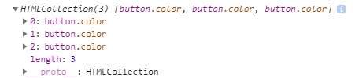
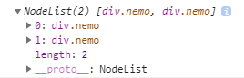
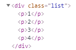
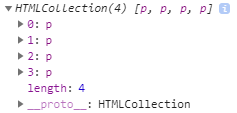

## DOM API
- DOM 조작
- 대상 → 행위 → 기능
- jquery : `$(선택자).on('이벤트', 기능);`
- document : 자바스크립트의 내장객체
- element : 태그

#### 여러가지 방법
```
<button onClick="alert('a')">클릭하기</button>
```
> HTML에 직접 넣음
```
<button onClick="test()">두번째</button>

<script>
  function test(){
    alert('b');
  }
</script>
```
#### 비표준
```
<button id="third">세번째</button>
```
```
document.getElementById('third').onclick = function(){
  alert('a');
}
```
> "세번째" 버튼을 클릭하면 경고창 a가 뜸

### 표준
- 권장 방식
- IE10 이하에서 적용X
```
<button id="open">네번째</button>
```
```
document.getElementById('open').addEventListener('click',function(){
  alert('b');
});
```
> "네번째" 버튼을 클릭하면 경고창에 b가 뜸
```
<button id="open">네번째</button>
<button id="open">다섯번째</button>
```
> 네번째 버튼에만 경고창이 뜸<br /> id는 자바스크립트에서 고유하다는 근본을 가지고있고 문서는 위에서부터 읽으므로 첫번로 인식되는것에만 걸리고 뒤에는 실행되지 않음
- id는 고유해 단수로 사용하므로 `Element`
```
console.log(document.getElementById('open'));
```
> <button id="open">네번째</button> 태그자체를 출력 


### 변수활용
```
var doc = document
var open = doc.getElementById('open');

open.addEventListener('click',function(){
  alert('c')
});
```

### 선택자 Class
- class는 복수라서 `Elements`
```
<button class="color">클래스</button>
<button class="color">클래스</button>
<button class="color">클래스</button>
```
```
console.log(doc.getElementsByClassName('color'));
```
- 결과

<br />
> 배열과 비슷한 방식인 Node List로 출력됨 그래서 원하는 대상을 호출할때 배열처럼 호출함
```
var color = doc.getElementsByClassName('color');

color[0].addEventListener('click',function(){
  alert('실행');
});
color[1].addEventListener('click',function(){
  alert('실행');
});
color[2].addEventListener('click',function(){
  alert('실행');
});
```
- 코드 간결화
```
for (var i = 0; i < color.length; i++) {
  color[i].addEventListener('click',function(){
    alert(i);  // 3 3 3
  });
}

i++
console.log(i);  // 4
```
> for문은 문서가 시작할때 시작해서 0,1,2에 각각 이벤트를 등록만 하고 프로세스가 끝남 그래서 function을 클릭할때는 i 가 이미 3이 되어있다.<br />즉, `이벤트를 등록하는 시점과 이벤트가 발생하는 시점이 다르다.`<br />function은 for문이 돌때 실행 되는게 아니라 끝난 뒤 클릭할때 실행되는 것이다.

```
<div class="nemo">hi</div>
<div class="nemo">hi</div>
```
```
var nemo = doc.querySelector('.nemo');

nemo.addEventListener('click',function(){
  nemo.innerHTML = 'hello';
});
```
> 첫번째 hi를 누르면 첫번째만 hello로 바뀜<br />class는 노드리스트라서 하나만 출력되고 나머지는 실행되지 않음
- 해결
```
var nemoGroup = doc.querySelectorAll('.nemo');
```
```
console.log(nemoGroup);
```
- 결과

<br />
> Node List
```
nemo.addEventListener('click',function(){
  for (var i = 0; i < nemoGroup.length; i++) {
    nemoGroup[i].innerHTML = 'hello';
  }
});
```
> 첫번째 hi를 누르면 전부 hello로 바뀜 

#### jquery의 click과 on
- click
```
$('div').click(function({ ~ });
```
> 단점 : 클릭만 사용가능
- on
```
$('div').on('click','.open',function(){ ~ });
```
```
$('div').on('click','mouseenter','mouseleave',function(){ ~ });
```
```
$( "div.test" ).on({
  click : function(){ ~ },
  mouseenter: function(){ ~ },
  mouseleave: function(){ ~ }
});
```
> 장점 : 클릭 외에 여러 동작의 function을 줄 수 있음

#### querySelector 와 getElementByTagName
```
<div class="list">
  <p>1</p>
  <p>2</p>
  <p>3</p>
  <p>4</p>
</div>
```
- querySelector 
```
var list = doc.querySelector('.list');
console.log(list);
```
- 결과

<br /><br />

- getElementsByTagName
```
var ptag = list.getElementsByTagName('p');
console.log(ptag);
```
- 결과

<br /><br />

#### jquery 와 비교
- javascript
```
document.querySelector('.list').getElementsByTagName('p');
```
- jquery
```
$('.list p');
```

### 텍스트 박스 값을 핸들링
```
<input type="text" id="user" />
<button id="ga">가져오기</button>
```
```
var plus = 0;
doc.getElementById('user').addEventListener('click', function(){
  plus = plus + 100;
  doc.getElementById('user').value = plus;
  doc.getElementById('user').classList.add('cc');
  doc.getElementById('user').classList.add('dd');
});
```
> input 박스를 클릭하면 100씩 증가와 동시에 class에 cc와 dd를 추가함
```
var ga = doc.getElementById('ga');
  ga.addEventListener('click', function(){
    doc.getElementById('user').classList.remove('cc');
    var a = doc.getElementById('user').value;
    var b = doc.getElementById('user').classList;
    console.log(a);
    console.log(b);
});
```
> 가져오기 버튼을 누르면 class 의 cc 는 삭제하고 텍스트 박스의 값과 클래스 목록을 콘솔로 가져옴


### 형제
```
<div id="list">
  <div class="box">1</div>
  <div class="box">2</div>
  <div class="box">3</div>
  <div class="box">4</div>
  <div class="box">5</div>
  <div class="box">6</div>
</div>
```
```
box[3].addEventListener('click',function(){
  console.log(box[3].style);
  box[2].style.color = 'red';
  box[4].style.color = 'red';
});
```
> 4 를 누르면 3과 5가 빨간색으로 변하고 콘솔에는 4의 모든 style의 대한 내용이 출력됨

```
box[3].addEventListener('click',function(){
  box[3].previousElementSibling.style.color = 'red';
  box[3].nextElementSibling.style.color = 'red';
});
```
> 위와 같은 효과
```
for (var i = 0; i < box.length; i++) {
  box[i].addEventListener('click',function(){
    box[i].previousElementSibling.style.color = 'red';
    box[i].nextElementSibling.style.color = 'red';
  });
}
```
> 클릭되는 시점에 i 는 이미 box의 갯수보다 하나 더 큰 7 인 상태이기 때문에 에러가 남
- 해결
```
for (var j = 0; j < box.length; j++) {
  box[j].addEventListener('click',function(){
    this.previousElementSibling.style.color = 'red';
    this.nextElementSibling.style.color = 'red';
  });
}
```
> 마지막과 첫번째는 이전과 이후가 없기때문에 에러 (과제1)
- this : 선택자를 가지고 행위를 했을때 this는 그 선택자 즉, `클릭할 당시의 대상`을 가르킴


### 박스 (animate의 편의성)
```
<style>
  .box {width:100px; height:100px; background:red; position:absolute;}
</style>

<div class="box"></div>
```
```
var box = document.querySelector('.box');
var move = 0;

box.addEventListener('click',function(){
  box.style.marginLeft = '100px';
});
```
> 상자를 오른쪽으로 100px 옮김
```
box.addEventListener('click',function(){
  box.style.left = '100px';
});
```
> 위와 같음 (position이 absoulte일 경우만 가능)
```
box.addEventListener('click',function(){
  box.style.marginLeft = '100px';
  if (move > 100) {
    return;
  }
});
```
> 오른쪽으로 100px가면 멈춤

#### javascript로 animate 구현
- javascript
```
box.addEventListener('click',function(){
  setInterval(function(){
    console.log('a');
    if (move > 100) {
      return;
    }
    move = move + 10;
    box.style.left = move + 'px';
  },100);
});
```
> 콘솔에 찍히는 a 를 보면 알겠지만 박스가 멈춰서 표면적으로 멈춘것 같지만 setInterval은 계속 실행되고 있음 (속도저하)
```
box.addEventListener('click',function(){
  var ani = setInterval(function(){
    console.log('a');
    if (move > 100) {
      clearInterval(ani);
      return;
    }
    move = move + 10;
    box.style.left = move + 'px';
  },100);
});
```
> clearInterval을 사용하기위해 변수를 통해 이름을 명명해주고 원하는 순간 setInterval을 멈춰줌

> if의 위치를 두번째 function 안에 넣어준 이유는 위에 function은 클릭과 동시에 끝나버림 즉, move가 0일때 끝남 그러니 아래 function 즉, 움직이기 전에 넣어야 함

- jquery
```
$('.box').animate({ left : 100 });
```
