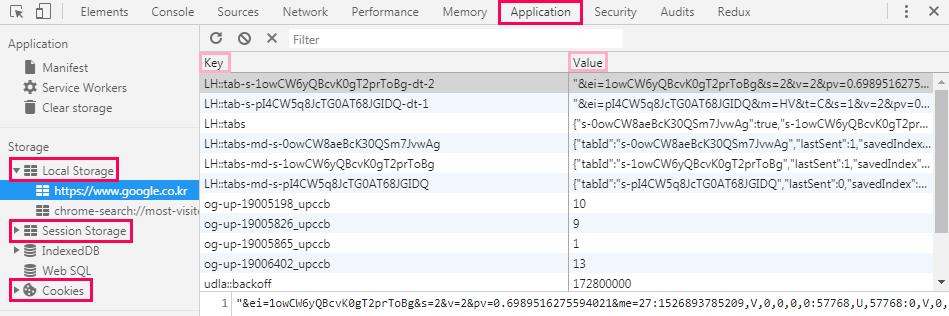
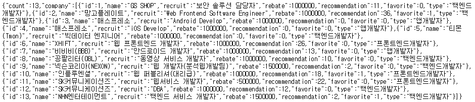
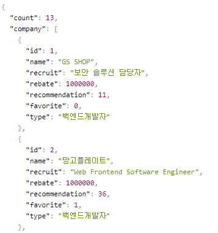
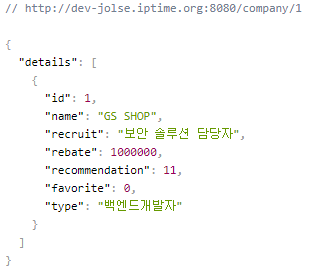

# backend와의 협업
- HTTP 프로토콜 : frontend와 backend가 대화하기 위해 생긴 약속
- JSON : 약속된 포맷

## HTTP 통신
- ajax : jquery에서 사용되는 API / 통신용 모듈
- frontend 와 backend간의 상호작용 (새로고침 없이)
- 웹 2.0 부터 HTTP 가 유명해짐

### 예시) 메일
- 한국(백엔드), 일본(모바일), 중국(데스크탑)
- "한국"이 "일본"에 "한국어"로 메일을 보냄 "한국"이 "중국"에 "한국어"로 메일을 보냄
- 일본과 중국이 한국어로 번역을하면 "데이터 변질"이 우려됨
- 그래서 영어(`JSON`)로 대화하기로 약속(`프로토콜`)함

## HTTP 프로토콜
- uri : 주소
- 통신메소드 : GET, POST, PUT, DELETE, header, cookie(세션)

## cookie
- 암호, 시그널
> 메일이 오면 읽어보기 전까지는 누가 보냈는지 모르니까 "한국"이 나에게 메일을 보냈다는 "신호"를 보내자
- localstorage, sessionstorage : cookie 대신 요즘 사용하는 것

## 저장기능 
- front

### cookie
- 기간설정이 가능
- exfire - 로그인, 로그아웃

### localstorage
- 영구저장
- 로그아웃하기 전까지 계속 로그인상태
- ex) google 로그인
- 정보를 지우려면 하드에서 삭제해야 함
- 리액트에서 사용

### sessionstorage
- 1회용
- 새로고침하면 정보가 날아감

#### 개발자 도구에서 확인하기

> key와 value로 저장됨

## HTTP 통신규약
- GET : 조회 (select)
- POST : 입력 (insert)
- PUT : 수정 (update)
- DELETE : 삭제 (delete)
> 기능 : (DB와 연결 / DB에서 사용하는 sql문법)
- 실제 개발시에는 GET과 POST만을 사용함 FORM 태그가 PUT과 DELETE를 지원하지 않기 때문 (GET은 DELETE와 방식이 같고, POST는 PUT과 방식이 같음)
> 웹은 새로고침형태로 개발하면 쉽지만 요즘은 실시간으로 그려주는 방식으로 바뀜

## GraphQL VS REST API
- GraphQL은 현재 유행, 협업시 유용
- REST API 기존 유행, 개발자가 적을때 유용

## RESTful API
- uri 자원을 가지고 목적을 보여주는 형태

### 예시) 같은 주소지만 어떤 방식으로 접속하느냐에 따라 출력되는 데이터가 서로 다름
- www.modu.com/frontend
> frontend에 대한 내용을 원한다는 의미
- www.modu.com/frontend (GET 방식으로 접속)
> 3기의 정보를 출력
- www.modu.com/frontend (POST 방식으로 접속)
> 4기의 정보를 출력
- www.modu.com/1 (PUT)
> 1기 정보를 수정
- www.modu.com/1 (DELETE)
> 1기 정보를 삭제

## GraphQL
- 내가 원하는 정보, 필요한 데이터만을 효율적으로 가져올 수 있음
> 백엔드에서 10개의 데이터를 던져주지만 10개중에 필요한 2개만을 가져올 수 있게 코드를 짤 수 있음
- 그래서 DB에 대한 이해가 반드시 필요!

## 통신
- http request : 통신요청
- promise : 비동기처리 (비동기 → 동기)
- fetch API : promise 기반
- ajax : jquery

## 서버
- dev-jolse.iptime.org
> 백엔드서버 엔드포인트
- dev-jolse.iptime.org:8080
> 8080 port (포트가 없는 웹은 전부 80 port)
- dev-jolse.iptime.org:8080/company
> 회사정보를 줘라 (전체조회)

 
- 웹스토어에서 JSON 뷰어 다운
> JSON(key, value)형태로 볼 수 있음

 
- dev-jolse.iptime.org:8080/company/id
> 해당 id에 대한 상세정보 조회

> dev-jolse.iptime.org:8080/company/1 즉, id가 1인 정보를 조회

## 그 외
- 슬래시( / ) 뒤에 들어가는 것이 rest
- 주소를 치고 엔터를 치는 행위는 무조건 GET 방식
- postman : HTTP 통신을 확인(frontend 확인)하는 프로그램
