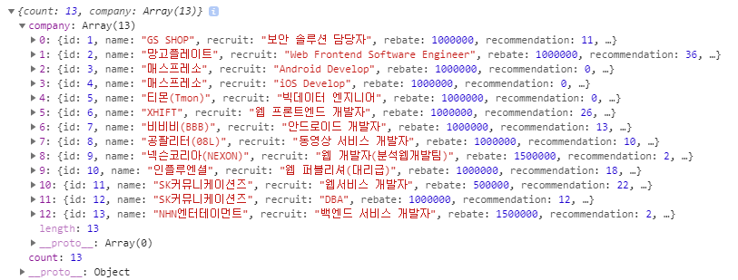
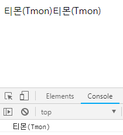
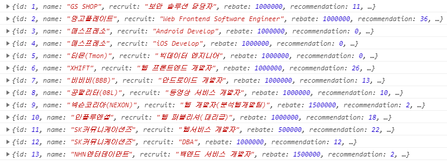
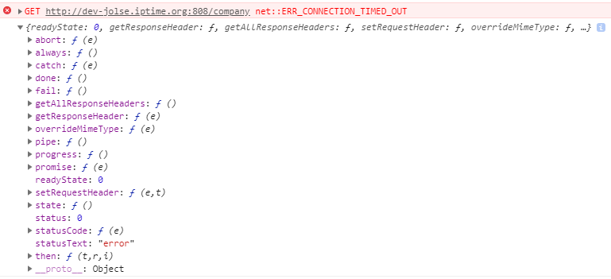
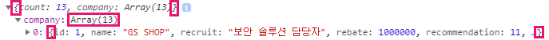

## jquery
```
$.ajax({  // HTTP 통신
  type : 'GET',  // 조회 타입
  url : 'http://dev-jolse.iptime.org:8080/company',  // 요청할 주소
  success : function(data){  // 콜백, response
    console.log(data);
  }
});
```
> 성공하면 data를 가지고와서 콘솔에 찍음
- 결과

<br />
### append
- 붙여주는 개념
- 누적
```
$.ajax({
  type : 'GET',
  url : 'http://dev-jolse.iptime.org:8080/company',
  success : function(data){
    var com = data.company[4].name;
    console.log(com);  // 티몬(Tmon)
    $('body').append(com);  // 티몬(Tmon)
    $('body').append(com);  // 티몬(Tmon)
  }
});
```
- 결과

<br />
### text
- 내용을 바꾸는 개념
- 여러개쓰면 하나만 출력
```
success : function(data){
  var com = data.company[4].name;
  console.log(com);  // 티몬(Tmon)
  $('body').text(com);  // 티몬(Tmon)
  $('body').text(com);  // X
}
```
### each
- 반복문을 사용할때 사용
- 첫번째 인자의 배열의 수만큼 함수가 자동으로 실행됨
```
success : function(data){
  var company = data.company;  // 배열
  $.each(company, function(index,value){
    console.log(value);
  });
}
```
- 결과

<br />
```
success : function(data){
  var company = data.company;  // 배열
  $.each(company, function(index,value){
    var tag = $('<div>');
    tag.text(value.name);
    $('body').append(tag);
  });
}
```
> $('<div>') 꺽쇠가 들어가면 태그로 만들어준다는 의미가 됨
- 결과
  
<br />
```
success : function(data){
  var company = data.company;  // 배열
  $.each(company, function(index,value){
    var tag = '<div>'+ value.name +'</div>'
    $('body').append(tag);
  });
}
```
> 같은 결과
```
$.ajax({
  type : 'GET',
  url : 'http://dev-jolse.iptime.org:808/company',
  success : function(data){
    console.log(data);
  },
  error : function(err){
    console.log(err);
  }
});
```
> 포트를 틀리게 설정하면 에러가 실행됨
- 결과

<br />
## JSON
- key와 value의 모음
- 객체와 배열이 합쳐져 있음

> company 객체 → 배열 → 객체
- 데이터에 대한 sorting(정렬)은 front가 함
- 데이터만으로도 해당 서비스의 이해가 가능하도록 개발을 해야함

## Javascript
```
var xhr = XMLHttpRequest();
```
> 내장객체지만 함수라서 객체가 아님
```
var xhr = new XMLHttpRequest();

console.log(xhr);  // XMLHttpRequest {...}
```
> 사용하기 위해 new를 사용해 객체로 리턴해줌
