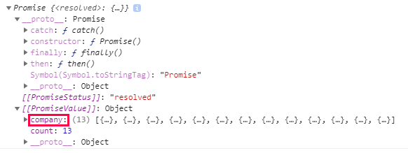
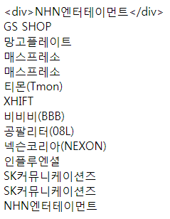

## promise
- 약속(내장객체)
- javascript는 기본적으로 비동기방식이지만, 콜백을 이용하면 동기방식으로 변경이 가능 (순차적으로 사용하기 위함)
- resolve : 성공 (다음 스텝으로 넘어감)
- reject : 실패 (다음 스텝으로 넘어가지 않음)
```
function s1(){
  return new Promise(function(resolve,reject){
    resolve();
    console.log('a');
  });
}

function s2(){
  return new Promise(function(resolve,reject){
    resolve();
    console.log('b');
  });
}

function s3(){
  return new Promise(function(resolve,reject){
    resolve();
    console.log('c');
  });
}
```
### then
- ~ 다음에 ( )를 실행
- 분기점을 마음대로 정할 수 있음
- 추가적으로 원하는 함수를 실행시킬 수 있음
```
s1().then(s2).then(s3);  // a, b, c
s1().then(s3).then(s2);  // a, c, b
```
```
s1().then(s3).then(s2).then(function(){
  console.log('end');
})
```
> a, c, b, end
```
function s3(){
  return new Promise(function(resolve,reject){
    reject();
    console.log('c');
  });
}

s1().then(s3).then(s2).then(function(){
  console.log('end');
}).catch(function(err){
  console.log(err);
});
```
> a, c, undefined
- `catch : reject를 만났을때 실행됨`
```
function s3(){
  var a = new Promise(function(resolve,reject){
    resolve();
    console.log('c');
  });
  return a;
}
```
> a, c, b, end
- 가독성
```
s1()
  .then(s3)
  .catch(function(e){
    console.log(e)
  })
  .then(function(){
    console.log('end');
  })
  .catch(function(err){
    console.log(err);
  });
```
> a, c, end

### ansync 와 await
- then 보다 가독성이 높음
- 브라우저 지원이 많지않아 아직은 사용하기 애매
```
async function aa(){
  await s1();
  await s2();
  await s3();
}
aa();  // a, b, c
```

## Fetch API
- HTTP 와 promise가 합쳐진 것
- promise와 fetch는 vue, react, anguler를 개발할때 사용
```
fetch('http://dev-jolse.iptime.org:8080/company').then(function(response){
  console.log(response.json());
});
```
> 타입은 안쓰면 기본으로 GET방식이 됨
- 결과

<br />
```
fetch('http://dev-jolse.iptime.org:8080/company')
  .then(response => {
    return response.json();
  }).then(data => {
    console.log(data)
  });
```
> {count: 13, company: Array(13)}
```
fetch('http://dev-jolse.iptime.org:8080/company')
  .then(response => response.json())
  .then(data => {

    var company = data.company;
    var tag = document.createElement('div');
    var text = document.createTextNode(company[0].name);

    tag.appendChild(text);
    document.body.appendChild(tag);  // GS SHOP
  });
```
### map
- 배열을 통해서 또다른 배열을 만듬
- 10개의 배열을 넣으면 10개의 배열이 나옴
- filter와 붙어다님
```
fetch('http://dev-jolse.iptime.org:8080/company')
  .then(response => response.json())
  .then(data => {

    var company = data.company;

    company.map(value => {

      let tag = document.createElement('div');
      let text = document.createTextNode(value.name);

      tag.appendChild(text);
      document.body.appendChild(tag);
    })
  });
```
- 결과

<br />
```
company.map(value => {
  if (value.favorite > 0) {} else {}
  ...
})
```
> favorite → 0 : 즐겨찾기X, 1 : 즐겨찾기O 상태에서 즐겨찾기가 되어있는 데이터를 가져올 경우 위에와 같이 if를 사용하는 것이 아니라 map에서는 filter를 사용해야 함
- jquery → each, for each
- javascript → map, filter
